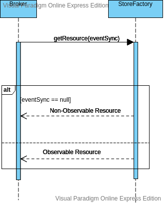

# Broker Eventing Developer Guide

Eventing module consist of basically two parts. 
- `Observable Reources` who listens to events in the broker.
- `Event Publisher` who publishes the Event information.

Following sequence diagrams can be used to understand the high level functionality of this module.
- Registering an Event Publisher

- Loading the needed resources

- Triggering an Event


## Current Resource Classes that trigger Events

- QueueRegistry
- ExchangeRegistry
- QueueHandler

## Adding a new Publisher

To develop a new Event Publisher and include it to publish events you should adopt the following steps,

- Implement the 
[EventSync](../../modules/broker-common/src/main/java/io/ballerina/messaging/broker/common/EventSync.java) 
interface in common module using the necessary code.
- Include the implementation path in broker.yaml file as below under namespace 
`ballerina.broker.events: publisherClass:`

## Adding new Event Listeners

To add new events first identify the resource class you need to listen to (ex:QueueRegistry) and identify the 
Observable wrapper implementation of the resource. Then add the needed event to the observable resource class. 
Furthermore, if you want to listen to a new resource class. You should wrap the resource class using decorator pattern 
and make an observable resource wrapper class.

example for a Queue Resource:
```java
interface QueueRegistry {
	void addQueue();
}

class QueueRegistryImpl implements QueueRegistry {  
	void addQueue() {
		//Code
	}
} 

class ObservableQueueRegistryImpl implements QueueRegistry {
    private QueueRegistryImpl queueRegistry;
    private EventSync eventSync;
    
    ObservableQueueRegistryImpl(QueueRegistryImpl queueRegistry, EventSync eventSync) {
        this.queueRegistry = queueRegistry;
        this.eventSync = eventSync;
    }
	void addQueue() {
		queueRegistry.addQueue();
		publishQueueAddedEvent(eventSync);
	}
}
```
### Adding a Event Triggering functionality to a new module

If you need to add Event Triggering functionality to a new module you should pass the event publisher to the new module.
Then you should repeat the above steps and implement event publishers for each resource class in the module.