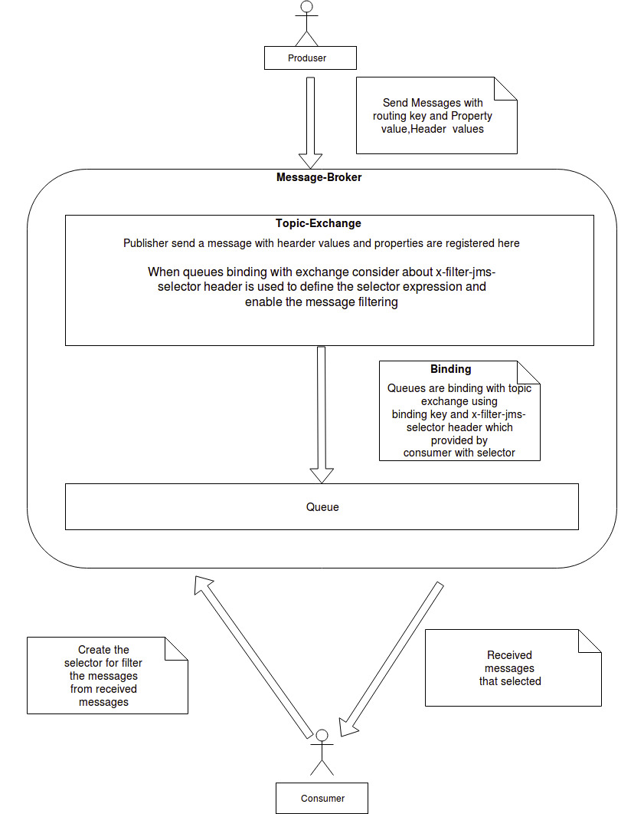
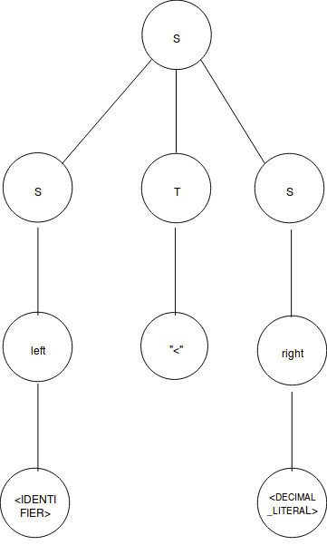

This document explains how to create message filtering service for the broker. Our approach to building a Javacc grammar selector parser with java classes as follows.
1.High level architecture
2.context free grammar and parse trees.
3.javacc parser grammar and supported java classes.
 
Following are the instructions in detail for the above steps.
1.High level architecture.

2.Context free grammar and parse trees.

A context-free grammar (CFG) consisting of a finite set of grammar rules is a quadruple(N,T, P, S) where
N is a set of non-terminal symbols.
T is a set of terminals where N ∩ T = NULL.
P is a set of rules, P: N → (N ∪ T)*, i.e., the left-hand side of the production rule P does have any right context or left context.
S is the start symbol.

Here is a context-free grammar for comparison expressions  in the variables ‘left’ and ‘right’.

S → SS | STS |(S ) | left | right 
right →<DECIMAL_LITERAL> | <HEX_LITERAL> | <OCTAL_LITERAL>
 | <FLOATING_POINT_LITERAL> | <STRING_LITERAL>
 T → TT | <EQUAL> | < GRATER_THAN> | < LESS_THAN>
           | <GRATER_EQAL>  |<LESS_EQUAL> |<NOTEQUAL>
           |”+”|”-”|”*”>|”/  ”|<NOT>|<LIKE>|<IS>|<AND>
           |<OR>|<NULL>|<BETWEEN>|<IN>|<ESCAPE>
<DECIMAL_LITERAL> → ["1"-"9"] (["0"-"9"])* (["l","L"])?
<HEX_LITERAL>  →  "0" ["x","X"] (["0"-"9","a"-"f","A"-"F"])+
 <OCTAL_LITERAL> → "0" (["0"-"7"])*
<FLOATING_POINT_LITERAL>    →    (["0"-"9"])+ "." (["0"-"9"])* (<EXPONENT>)?  
                                                             | "." (["0"-"9"])+ (<EXPONENT>)?
                                                             |(["0"-"9"])+ <EXPONENT>
<EXPONENT > →  "E" (["+","-"])? (["0"-"9"])
<STRING_LITERAL> →  " ' " ((" ' ' ") | ~[" ' "] )* " ' "
left → <IDENTIFIER> 
<IDENTIFIER> → ["a"-"z","A"-"Z"](["a"-"z","A"-"Z","0"-"9","_","$"])*

<EQUAL>  →  “=”
<GRATER_THAN> → “>”
<LESS_THAN> → “<”
<GRATER_EQAL> → “>=”
<LESS_EQUAL>  → “<=”
<NOTEQUAL> → “<>”
<NOT> → “NOT”
<LIKE>  → “LIKE”
<IS> → “IS”
<AND> →  “AND”
<OR> → “OR”
<NULL> → “NULL”
<BETWEEN> →  “BETWEEN”
<IN> → “IN”
<ESCAPE> →  “ESCAPE”

This grammar can generate “Myproperty < 9 ” selector string.
S → STS 
S → left “<” right 
S → <IDENTIFIER> “<” <DECIMAL_LITERAL> 
S → Myproperty “<” 9 

This is the parser tree
.

3.Javacc parser grammar and supported java classes.
.

- As a selector query enters the broker, it first reaches the class ‘MessageFIlter” which is generated through the parser file, ‘SelectorParser.jj’.

- The first step in processing the selector is to identify the type of selector. The following precedence order takes place In identifying the type.

    OrExpression()
    AndExpression()
    NotExpression()
    ComparisonExpression()

- Since selector does not match the criteria of the first three  expressions it is considered as a comparison expression.
 
- As the selector query reaches the comparison expression function, at the second step left value is evaluated by comparing with the following functions in the given precedence order.

    sum()
    factor()
    unary()
    element()

- Since the selector does not match with the first three functions, then it is considered as an element. Hence the element itself is derived as the left variable and processed  in the following order.

    identifier()
    value()
    “(”sum()”)”

- Whether the left value is recognized as an identifier, then value is  passed to the left expression.

- As the third step,  the left expression reaches the value and parser file finds the next symbol of the selector query.

- As it recognizes the symbol(<LESS_THAN> “<”), then the right value is evaluated over the following functions in the given order as the fourth step.
   
    unary()
    element()
    
- The right value identification is as same as the left value identification process as above explained and if the value is not recognized as an element, it is considered as a value.

- As per the given example, the right value is a decimal literal(context free grammar written at the beginning of the doc).

- Succeeding  that, at the  fifth step the parser file moves the value of the right expression to the comparison operation which is inside the java class.

- At the sixth step java class evaluates the comparison expression and returns the boolean type value.

- As the final step, the  returned value is passed to the parser selector function and only the true values are evaluated by it.

 

