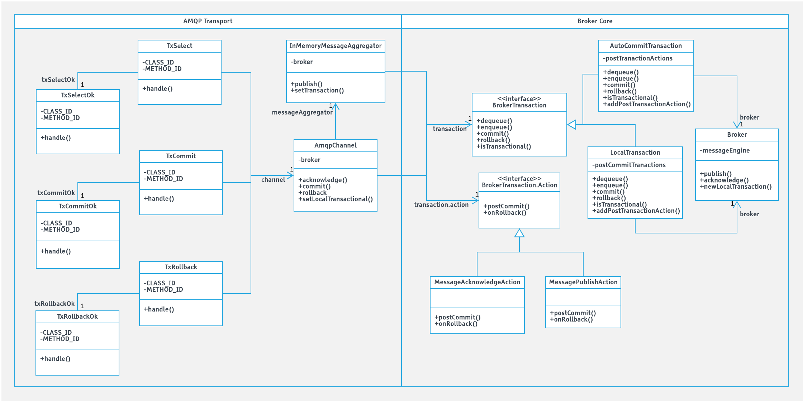

# Local Transaction Design

The broker core handles both transactional and non-transactional in a unified way implementing BrokerTransaction 
interface. AutoCommitTransaction is the non-transactional implementation and LocalTransaction is the local transactional 
implementation. AMQP transport register tx.select, tx.commit, tx.rollback and broker core act based on the relevant 
operation. 

Message acknowledge considering as dequeue and message publish considering as enqueue. AutoCommitTransaction directly 
invokes the Broker API on dequeue or enqueue operation and there is no effect on commit or rollback. If somebody calls 
tx.commit or tx.rollback on the non-transactional channel, it wll end up in channel exception as per the spec.

In LocalTransaction, when tx.select comes to the broker, it initiates the local transaction on the channel by calling 
the newLocalTransaction(). Then enqueue and dequeue storing messages in memory until commit or rollback received from 
the client.

Below is the high-level class diagram of the local transaction design.

