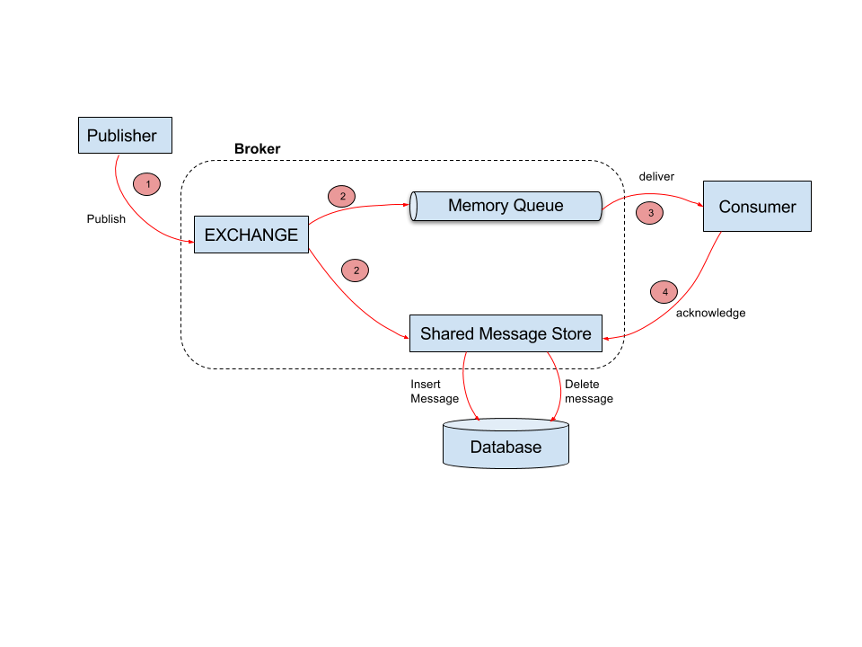

# Message Persistence Layer

The broker contains a message persistence layer which acts as an interface for the underlying
persistence storage used. This is the known as the shared message storage of the broker.

## Implementation details

Following diagram shows how a durable message flows through the broker

1. Message published to an exchange.
2. Message is routed to the relevant memory queue as well as the shared message store (Shared message
   store acts as a persistence layer interface for all the durable queues).
3. Deliver message to the consumer through message delivery tasks.
4. Acknowledgment of the message is received by the shared message store.

On step 2 and 4 shared message store internally creates a database insert and delete operation for the message
respectively. These operations are executed in batches asynchronously using an [LMAX Disruptor](
https://github.com/LMAX-Exchange/disruptor).

## Optimisations

Since database operations are done asynchronously and in batches there is an opportunity to cancel out some 
database operations. 

For instance in a high throughput scenario, acknowledgments for messages will come to the
shared message store before the corresponding insert operations are executed. In that case shared message store
will cancel out the insert and delete operations avoiding an additional overhead of persisting the messages.
