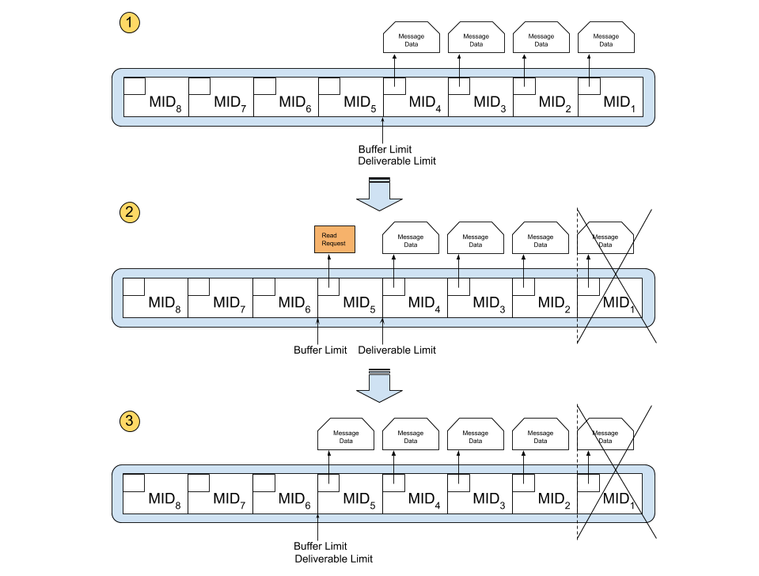

# Message Persistence 

Message broker will persist all persistence messages published to a durable queue. The configured RDBMS is used as 
the storage of these messages. Storing messages in a reliable medium is required to recover messages in case of a 
failure. 

## Durable queue message partial loading 

Even though it is ideal to keep all message data in memory, we cannot do that since memory is a limited resource. 
Therefore we have implemented the following data structure to optimize memory usage.

1. In each queue buffer, we will put message with message data until we reach the buffer limit. After that only the 
   message ID and queue attachment information is stored in the queue buffer to avoid filling memory.
2. When one of the messages in the queue buffer is acknowledged, we will proceed the buffer limit cursor and send 
   message data read requests to fill the message data.
3. When the message data is read from database and filled, the deliverable limit cursor will be progressed to make that 
   message deliverable.
   
When we start a node only the message id and queue attachment information is loaded. The handling logic will then 
asynchronously load message data to memory.