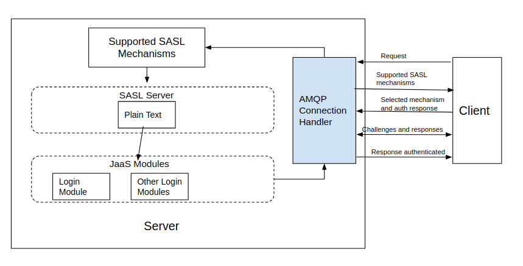

# Message Broker Security Architecture

## Authentication

AMQP specification defined the authentication mechanism and security content data is based on Simple Authentication
and Security Layer(SASL) framework. Following figure shows the authentication security architecture.




Once client request  a connection, server will send the supported SASL mechanisms to client. Message broker supports
PLAIN text SASL mechanism.

After that client will send the selected mechanism + auth response data. Server will create SASL server based on the
client mechanism and then server will evaluate the client authentication data . Then SASL server will call the 
registered authenticator for broker. Broker will use Java Authentication and Authorization Service 
(JAAS) as default authentication implementation. Once authenticator authenticate the plain text username and 
password, it will response authentication result with authentication Id. 

 Users can defined their own JAAS Login module or write own custom authenticators as well.
  - [Changing the Default Security Settings](../user/authentication-settings-guide.md)

If authentication is successful, connection will be established or else will send authentication error.

### Writing a custom authenticator

Custom authenticator should implement the [Authenticator](https://github.com/ballerina-platform/ballerina-message-broker/blob/master/modules/broker-auth/src/main/java/io/ballerina/messaging/broker/auth/authentication/Authenticator.java) interface and handle the 
authentication underlying logic. Message broker is only interested in [AuthResult](https://github.com/ballerina-platform/ballerina-message-broker/blob/master/modules/broker-auth/src/main/java/io/ballerina/messaging/broker/auth/authentication/AuthResult.java) 
return from the implementation. Following is the small description about interface methods.

1. Prepare the authenticator to start authentication.
    ```
        void initialize(StartupContext startupContext,
                        UserStore userStore,
                        Map<String, Object> properties) throws Exception;
    ```

2. Authenticate a user and provide a result to the message broker.

    ```
        AuthResult authenticate(String username, char[] password) 
                        throws AuthException;
    ```

The default authenticator [JaasAuthenticator](https://github.com/ballerina-platform/ballerina-message-broker/blob/master/modules/broker-auth/src/main/java/io/ballerina/messaging/broker/auth/authentication/authenticator/JaasAuthenticator.java) 
is based on JAAS and provides a custom LoginModule implementation call [UserStoreLoginModule](https://github.com/ballerina-platform/ballerina-message-broker/blob/master/modules/broker-auth/src/main/java/io/ballerina/messaging/broker/auth/authentication/jaas/UserStoreLoginModule.java).

A developer can pass supporting information to the custom authenticator via properties in the `initialize` method. 
It should be set in the broker.yaml as below.

```    
        properties:
         key: value
```

Value can be even another class. Please refer to the broker.yaml configuration to see how the `UserStoreLoginModule` 
set in the properties. 

## Authorization

Access control model of message broker based on the Mandatory Access Control (MAC) and Discretionary Access Control (DAC). 
The baseline is to provide more granular access control to the message broker resources through combination from above 
two approaches. Mandatory access control levels defined by default and admin user assigned to them. Those are 
explained in the [User Guide](../user/authorization-settings-guide.md).

A user has particular MAC scope on the resources has authority to perform the action regardless of the owner. The DAC 
permission creates on demand with the resource creation and the owner has authority to perform necessary actions. 
For an example user who had queue:create a scope (MAC) could create a queue and he will get consume and publish action 
for the same resource (DAC).

### Writing a custom authorizer

Authorization can customize implement either MAC or DAC handler interfaces. The responsible interface for the 
MAC is [MandatoryAccessController](https://github.com/ballerina-platform/ballerina-message-broker/blob/master/modules/broker-auth/src/main/java/io/ballerina/messaging/broker/auth/authorization/MandatoryAccessController.java) and for the DAC is [DiscretionaryAccessController](https://github.com/ballerina-platform/ballerina-message-broker/blob/master/modules/broker-auth/src/main/java/io/ballerina/messaging/broker/auth/authorization/DiscretionaryAccessController.java).
User store is the other vital part of the authorization. The default user store [FileBasedUserStore](https://github.com/ballerina-platform/ballerina-message-broker/blob/master/modules/broker-auth/src/main/java/io/ballerina/messaging/broker/auth/authorization/provider/FileBasedUserStore.java) implementation 
based on the file system and it has provided to validate the user when assigning permissions. 
A developer has the flexibility to customize the authorization mechanism by implementing any of the above components.
