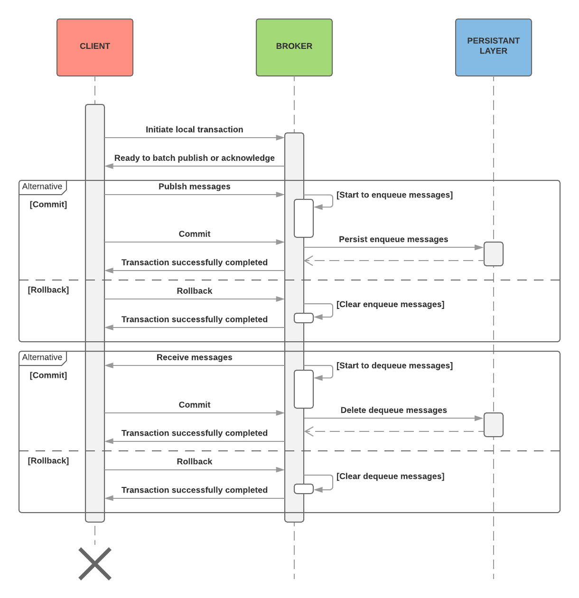

# Local transaction
The broker semantics of handling local transaction is based on the AMQP version 0-9-1 specification. The broker allows 
publish and acknowledge operations to be batched into atomic units of work until client confirm it succeeds or fails by 
doing commit or rollback. The following high-level sequence diagram depicting how the main flow of transaction works.



## Client library support
The client application could use any library align with AMQP protocol. It may have its own way of handling the local 
transaction. For an example, JMS client (ex: WSO2 andes-client) starts to act as transactional based on the value set for 
the transacted parameter when initializing the session.
```
QueueSession createQueueSession(boolean transacted,
                                int acknowledgeMode)
                                throws JMSException
```

But AMQP client (ex: RabbitMQ amqp-client) should invoke following method to begin the transaction.
```
Channel channel = connection.createChannel();
channel.txSelect();
```
After the transaction is started, rest of the messages that are published and acknowledged kept in the broker memory 
until client confirm unit of work should be commit or rollback. The JMS client invokes commit or rollback as below.
```
queueSession.commit() or queueSession.rollback()
```

The AMQP client handles the same thing in following way. 
```
channel.txCommit() or channel.txRollback()
```

The broker will conclude transaction completed upon receiving any of above operation.

## Samples

Please refer to the https://docs.wso2.com/display/MB320/Using+Transactional+Sessions for samples.