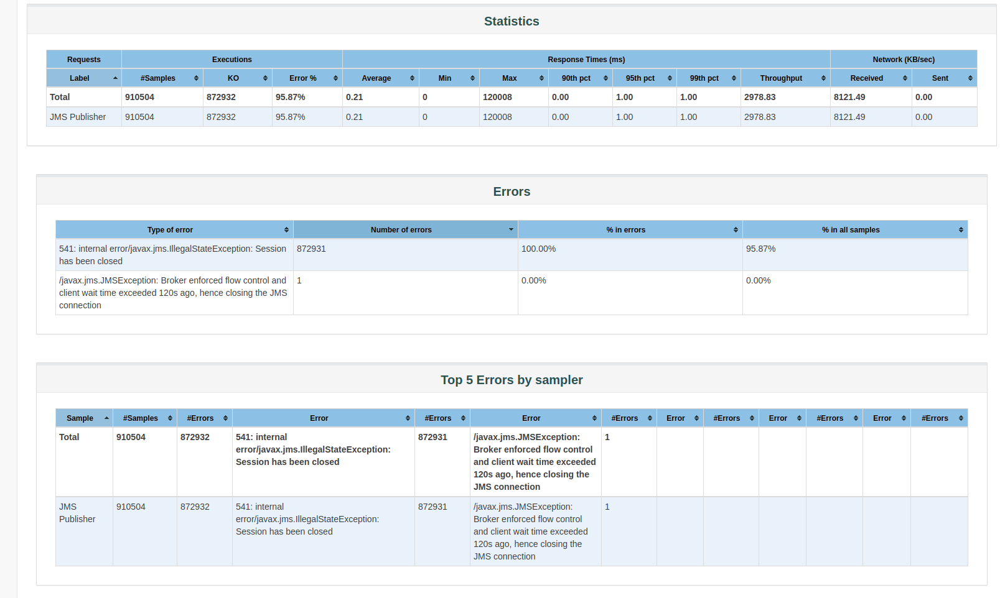
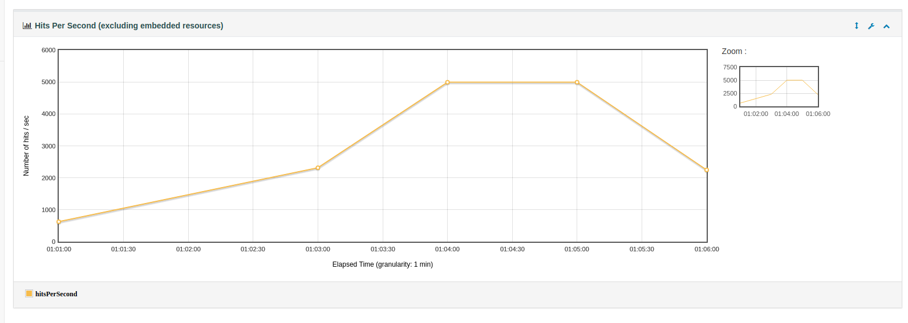

# Microbenchmark for Ballerina Message Broker

This tool allows ballerina message broker developers to get an idea about the performance of the message broker after a modification is done in the code. Following criteria is used in evaluating the performance.

- Connection Load  - The number of message producers , or the number of concurrent connections a system can support.
- Message throughput - The number of messages or message bytes that can be pumped through a messaging system per second.

At the moment the tool allows developers to publish messages to queues and test the performance and get a report of the result.

## How to use 

1. Copy following jars to JMETER_HOME/lib.

    - andes-client-0.13.wso2v8.jar
    - geronimo-jms_1.1_spec-1.1.0.wso2v1.jar
    - slf4j-1.5.10.wso2v1.jar

2. Create a queue named micro_benchmark_queue in broker

3. Include the following details in ballerina_message_broker_performance_test.properties file which is located at resources/.
```properties
jmeter_home = <jmeter_home>
jmx_file_location = <jmx_file_location>
jndi_file_location = <jndi_file_location>
thread_count = <number_of_threads>
message_size = <size_of_the_message>
number_of_messages = <number_of_messages_need_to_be_published>
throughput= <throughput_need_to_be_maintained>
```
4.Run ```./broker_performance_test.sh <location_of_properties_file>```

Upon completion of the test,you will be directed to a web interface which contains the summary of the results obtained by the test.




## Special Notes

- Use 1KB , 10KB , 100KB , 1MB as inputs to the message_size paramter in properties file.
    - 1KB = 1 KB message
    - 10KB = 10 KB message
    - 100KB = 100KB message
    - 1MB = 1MB message 
  
- Following values are used as default values for some of the above mentioned parameters.
    - jmx_file_location = test_plan/ballerina_message_broker_performance_test.jmx
    - jndi_file_location = resources/jndi.properties
    - thread_count = 1
    - message_size = 10
    - number_of_messages = 1000000
    - throughput = 5000 (5000 messages/seconds)
    


